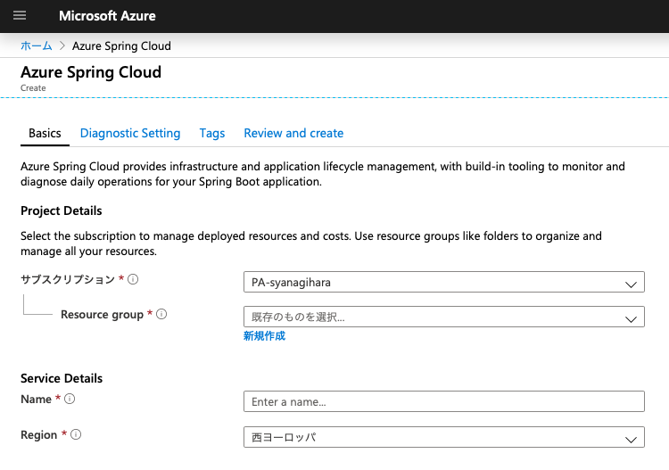
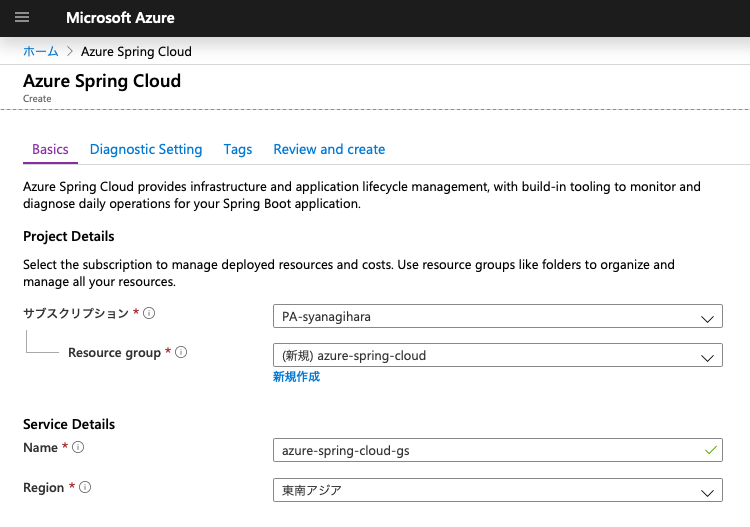
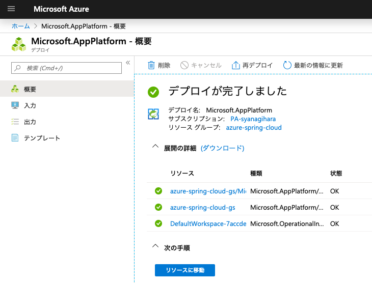

# Azure Spring Cloud Getting Started

Overview

## Description

## Demo

## Features

- feature:1
- feature:2

## Requirement

## Usage
### 00. Prerequisite
#### Install Azure CLI
```
$ brew update
$ brew install azure-cli
```
#### Login Azure
```
$ az login

$ az account list -o table
Name            CloudName    SubscriptionId                        State    IsDefault
--------------  -----------  ------------------------------------  -------  -----------
PA-syanagihara  AzureCloud   aaaaaaaa-bbbb-cccc-dddd-eeeeeeeeeeee  Enabled  True
```

```
$ az account set --subscription <target subscription ID>
```

#### Install the Azure CLI extension
```
$ az extension add --name spring-cloud

The installed extension 'spring-cloud' is in preview.
```

### 01. Create a Service Instance on the Azure portal

- [Azure Portal for ASC](https://ms.portal.azure.com/#create/Microsoft.AppPlatform)



#### Fill out the form


- **Resource group**: `azure-spring-cloud`
- **Service Instance Name**: `azure-spring-cloud-gs`

- `Review and create` -> `Create`



#### Configure the CLI to use Service Instance

```
$ az configure --defaults group=<RESOURCE_GROUP_NAME>
$ az configure --defaults spring-cloud=<SERVICE_INSTANCE_NAME>
$ az configure -l
```

### 02. Create a First Simple App


## Installation

## Licence

Released under the [MIT license](https://gist.githubusercontent.com/shinyay/56e54ee4c0e22db8211e05e70a63247e/raw/34c6fdd50d54aa8e23560c296424aeb61599aa71/LICENSE)

## Author

[shinyay](https://github.com/shinyay)
