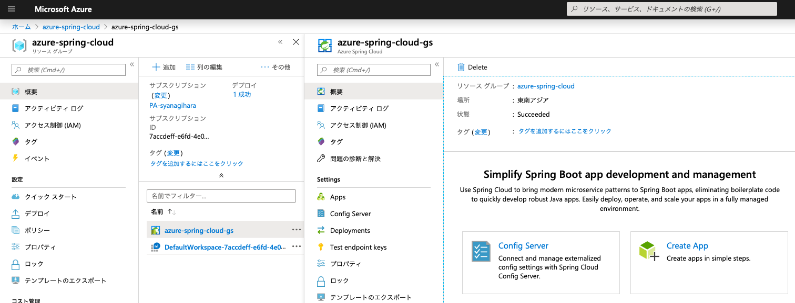

# Azure Spring Cloud Getting Started

Overview

## Description

## Demo

## Features

- feature:1
- feature:2

## Requirement

## Usage
### 00. Prerequisite
#### Install Azure CLI
```
$ brew update
$ brew install azure-cli
```
#### Login Azure
```
$ az login

$ az account list -o table
Name            CloudName    SubscriptionId                        State    IsDefault
--------------  -----------  ------------------------------------  -------  -----------
PA-syanagihara  AzureCloud   aaaaaaaa-bbbb-cccc-dddd-eeeeeeeeeeee  Enabled  True
```

```
$ az account set --subscription <target subscription ID>
```

#### Install the Azure CLI extension
```
$ az extension add --name spring-cloud

The installed extension 'spring-cloud' is in preview.
```

### 01. Create a Service Instance on the Azure portal

- [Azure Portal for ASC](https://ms.portal.azure.com/#create/Microsoft.AppPlatform)


#### Fill out the form


- **Resource group**: `azure-spring-cloud`
- **Service Instance Name**: `azure-spring-cloud-gs`

- `Review and create` -> `Create`


#### Configure the CLI to use Service Instance

```
$ az configure --defaults group=<RESOURCE_GROUP_NAME>
$ az configure --defaults spring-cloud=<SERVICE_INSTANCE_NAME>
$ az configure -l
```

### 02. Create a First Simple App
`Azure Spring Cloud Resource Group` -> `Create App`



- App name
- Java environment
- CPU
- Memory/GB
- App Instance Count


#### Deploy a First App
```
$ az spring-cloud app deploy -n hello-azure --jar-path hello-azure/build/libs/hello-azure-0.0.1-SNAPSHOT.jar
```
```json
Command group 'spring-cloud' is in preview. It may be changed/removed in a future release.
{
  "id": "/subscriptions/7accdeff-e6fd-4e03-839a-9011201fdea9/resourceGroups/azure-spring-cloud/providers/Microsoft.AppPlatform/Spring/azure-spring-cloud-gs/apps/hello-azure/deployments/default",
  "name": "default",
  "properties": {
    "active": true,
    "appName": "hello-azure",
    "createdTime": null,
    "deploymentSettings": {
      "cpu": 1,
      "environmentVariables": null,
      "instanceCount": 1,
      "jvmOptions": null,
      "memoryInGb": 1,
      "runtimeVersion": "Java_8"
    },
    "instances": [
      {
        "discoveryStatus": "DOWN",
        "name": "hello-azure-default-11-6c776599bc-db5wl",
        "reason": null,
        "status": "Running"
      },
      {
        "discoveryStatus": "UP",
        "name": "hello-azure-default-11-d9d55fcbd-2gbhw",
        "reason": null,
        "status": "Retiring"
      }
    ],
    "provisioningState": "Succeeded",
    "source": {
      "artifactSelector": null,
      "relativePath": "resources/453cde82348c45cdd99ebc1614151706fd9b2d00c8727dcdeb4a9150d0e82a74-2019112111-1fdc2c6e-905f-41ba-bf2c-d809f891f523",
      "type": "Jar",
      "version": null
    },
    "status": "Upgrading"
  },
  "resourceGroup": "azure-spring-cloud",
  "type": "Microsoft.AppPlatform/Spring/apps/deployments"
}
```

#### Running App


```
$ curl <TEST_ENDPOINT>
```


## Installation

## Licence

Released under the [MIT license](https://gist.githubusercontent.com/shinyay/56e54ee4c0e22db8211e05e70a63247e/raw/34c6fdd50d54aa8e23560c296424aeb61599aa71/LICENSE)

## Author

[shinyay](https://github.com/shinyay)
